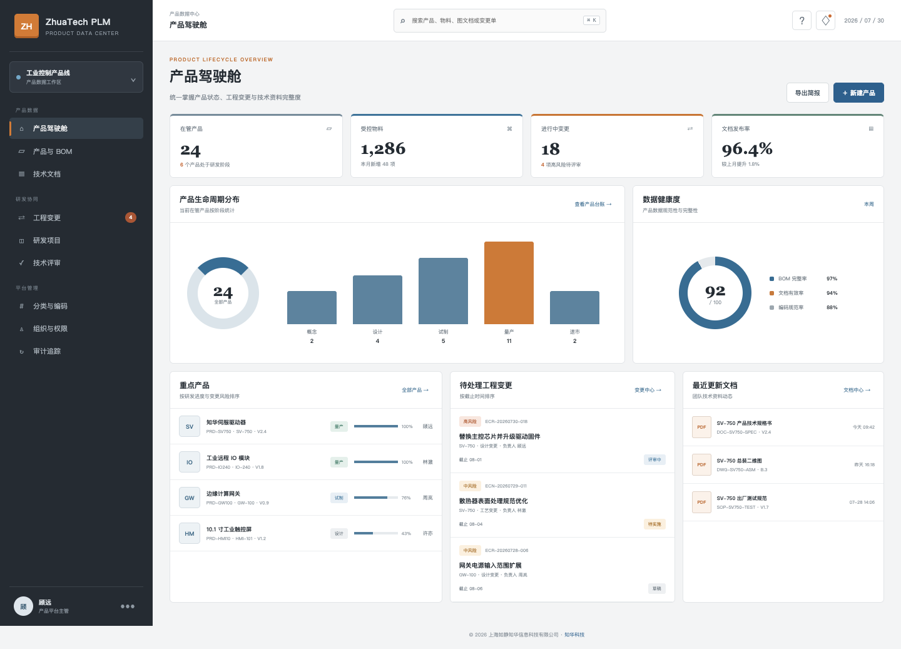
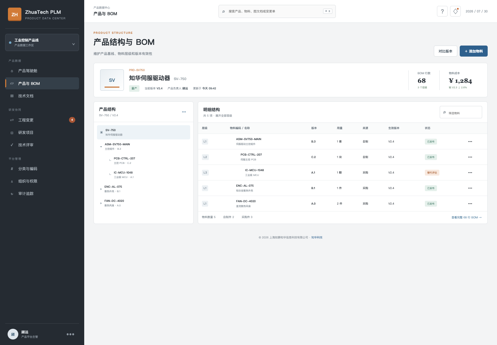
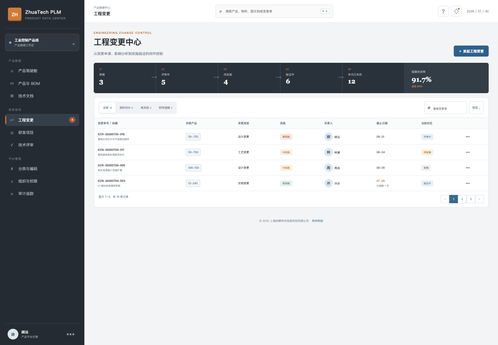
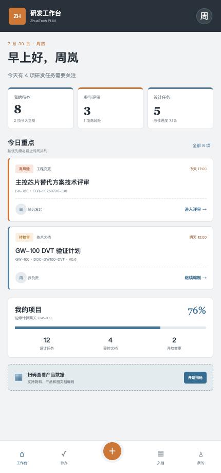

[简体中文](README.md) | **English**

# ZhuaTech Product Lifecycle Management

> A source-available enterprise project by [ZhuaTech](https://www.zhuatech.cn/) for manufacturing planning, execution, quality, and traceability.

ZhuaTech Product Lifecycle Management provides a practical, self-hosted foundation for manufacturing planning, execution, quality, and traceability. It is designed for manufacturing planners, production teams, quality teams, and plant managers, with clear business records, controlled workflows, operational visibility, and auditable actions.

This repository is intended for learning, technical evaluation, and non-commercial collaboration. The included implementation, tests, database resources, and container configuration provide a reproducible starting point for further enterprise adaptation.

**Search topics:** enterprise product lifecycle management, self-hosted product lifecycle management, Java Spring Boot enterprise software, digital transformation.

## Product Scope

- **Primary users:** Manufacturing planners, production teams, quality teams, and plant managers.
- **Deployment model:** Self-hosted, with container-based local deployment where supported.
- **Governance baseline:** Role-aware operations, validation, approval boundaries, exception handling, and auditability.
- **Production boundary:** Review security, identity, backup, observability, capacity, and compliance controls before production use.

## Capability Map

- **User** — Manage user with ownership, validation, and explicit lifecycle states.
- **Product** — Coordinate product through controlled workflows and approval gates.
- **Part** — Track part metrics, exceptions, deadlines, and follow-up actions.
- **Bom Item** — Preserve bom item evidence in searchable, traceable operational history.
- **Change Request** — Expose change request in role-aware user and administration workspaces.
- **Technical Document** — Connect technical document to external systems through configurable integration boundaries.

## Technology Baseline

**Technology stack:** Java 21 · Spring Boot · Vue 3 · Vite · MySQL 8 · Docker Compose

### Repository Layout

- `backend/` — Java backend, domain services, APIs, validation, and automated tests
- `frontend/` — responsive user and administration interfaces
- `deploy/` — deployment and operations resources
- `docs/` — architecture, operations, screenshots, and supporting documentation
- `compose.yaml` — local multi-service orchestration

## Run Locally

```bash
docker compose up -d --build
```

- Review `compose.yaml` before changing published ports, storage paths, or production credentials.

## Verification

Run the checks supported by this repository before changing or deploying it:

```bash
cd backend && mvn test
cd frontend && npm ci && npm run build
```

## Interface Preview

### Plm Lifecycle Dashboard



### Plm Product Bom



### Plm Change Center



### Plm Engineer Workbench



## Security and Production Readiness

- Never commit real passwords, API keys, tokens, certificates, customer data, or production connection strings.
- Replace all local demonstration credentials and secrets before deployment.
- Apply least privilege, tenant isolation, backup and restore drills, monitoring, rate limiting, and vulnerability management.
- Please report security issues privately through the contact channels below instead of publishing sensitive details.

## Usage and Commercial Licensing

Copyright © 2026 Shanghai Rujing Zhihua Information Technology Co., Ltd.

This project is a publicly available source edition intended solely for personal learning, technical research, and non-commercial communication. Commercial use, paid delivery, resale, hosted commercial services, and commercial derivative distribution require prior written authorization from the copyright holder.

Third-party dependencies remain subject to their respective licenses. Review the repository `LICENSE` and `NOTICE` files before use.

## Commercial Licensing and Enterprise Services

For commercial licensing, private deployment, enterprise customization, software outsourcing, implementation services, FDE outsourcing, OPC technical support, or AI transformation consulting, contact ZhuaTech:

- Email: [han@zhuatech.cn](mailto:han@zhuatech.cn)
- Email: [jack@zhuatech.cn](mailto:jack@zhuatech.cn)
- [WhatsApp: +86 17521234993](https://wa.me/8617521234993)
- Website: [https://www.zhuatech.cn/](https://www.zhuatech.cn/)

## About ZhuaTech

[ZhuaTech](https://www.zhuatech.cn/) is operated by Shanghai Rujing Zhihua Information Technology Co., Ltd. We support small and medium-sized enterprises with digital transformation, AI adoption, enterprise software implementation, custom development, software project outsourcing, FDE services, OPC integration, and long-term technical support.
