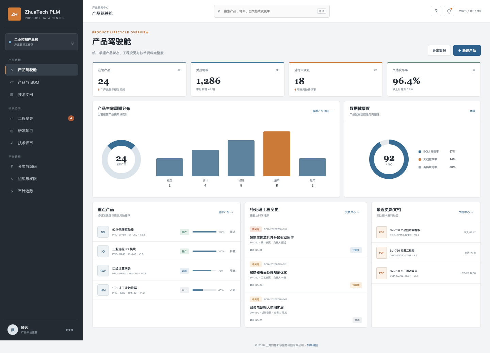
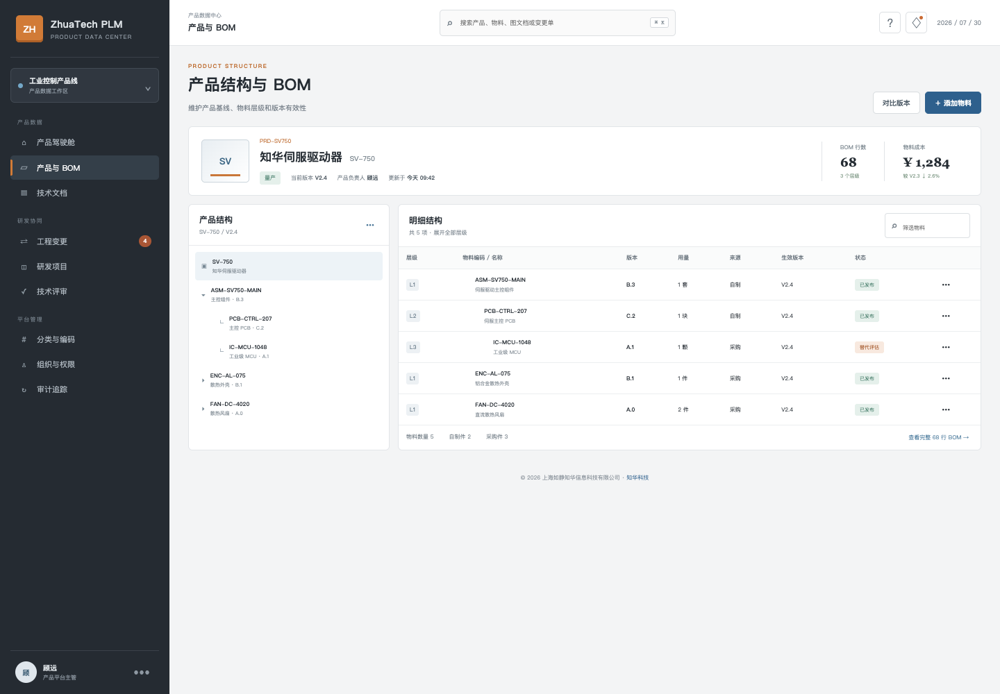
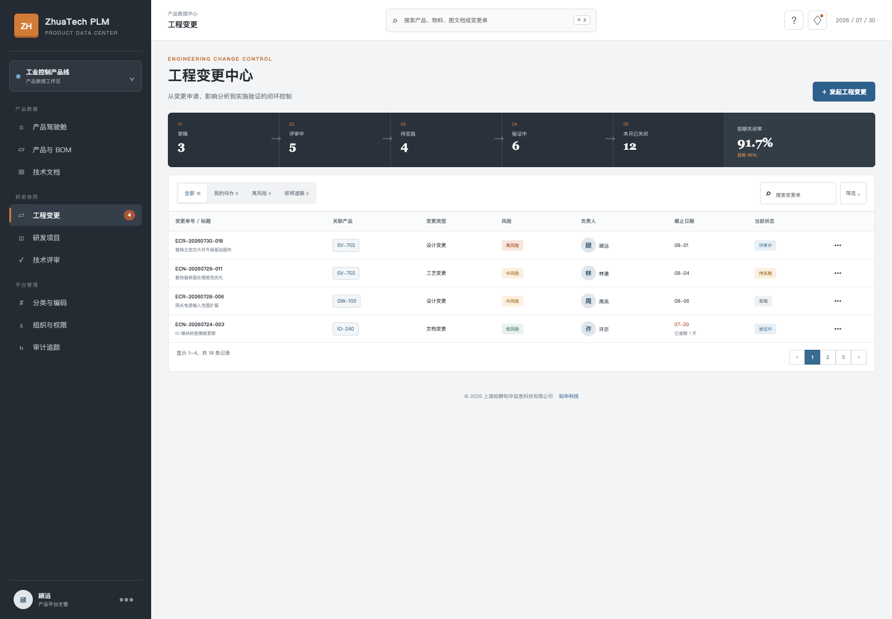
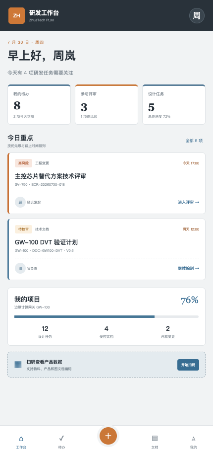

# ZhuaTech PLM · 知华科技产品生命周期管理系统

<p align="center">
  
  
  
  
  
</p>

ZhuaTech PLM 是由 **知华科技（上海如静知华信息科技有限公司）** 发布的产品生命周期管理系统社区源码版。项目采用 Java、Spring Boot、Vue 和 MySQL 构建，把产品、物料、BOM、技术文档、工程变更与研发任务放进同一条可追溯的数据链。

官网：[https://www.zhuatech.cn/](https://www.zhuatech.cn/)

> [!IMPORTANT]
> 本工程仅限个人学习、技术研究和非商业交流，**不得商用**。企业内部使用、交付、SaaS、培训收费、投标、咨询实施、二次销售等商业用途，均须事先取得上海如静知华信息科技有限公司书面授权。详细条款见 [LICENSE](LICENSE)。本许可含非商业限制，因此本项目准确定位为“社区源码版”，并非 OSI 认定的开源软件。

## 一张图理解这套系统

```text
市场需求 / 产品规划
          │
          ▼
  产品主数据 ───── 物料与分类编码
      │                   │
      ├──── EBOM / 版本基线 ──── 技术图文档
      │              │                 │
      └──────── 工程变更 ECR / ECN ────┘
                         │
                         ▼
               评审 → 实施 → 验证 → 关闭
```

这套项目适合作为 **PLM 开源项目、Java 产品生命周期管理系统、BOM 管理系统、工程变更管理、图文档管理、研发项目管理、Vue 企业后台、Spring Boot 前后端分离项目** 的学习与非商业研究样例。

## 界面档案

所有下列图片都来自本仓库前端的真实运行页面。

### 01 · 产品生命周期驾驶舱

从在管产品、受控物料、变更风险、文档发布率和数据健康度切入，帮助产品负责人快速定位研发数据问题。



### 02 · 产品结构与多层级 BOM

产品基线、物料树和 BOM 明细在同一页面呈现，包含层级、版本、用量、来源、生效版本与替代评估状态。



### 03 · 工程变更中心

覆盖草稿、技术评审、实施、验证和关闭过程，以风险和期限驱动 ECR/ECN 闭环。



### 04 · 工程师 H5 工作台

移动端聚焦个人待办、技术评审、文档校审、研发项目进度和扫码查询，适配手机与现场手持终端。

<p align="center"></p>

## 能力地图

| 领域 | 当前社区版能力 | 使用角色 |
|---|---|---|
| 产品主数据 | 产品编码、型号、版本、生命周期阶段、负责人、发布状态 | 产品经理、产品工程师 |
| 物料中心 | 物料编码、分类、规格、单位、版本与受控状态 | 结构/电子工程师 |
| 产品结构 | 多层级 EBOM、父子物料、用量、来源、生效版本 | BOM 工程师 |
| 技术文档 | 规格书、图纸、测试规范、验证文件及版本状态 | 文控、研发工程师 |
| 工程变更 | ECR/ECN、变更类型、原因、风险、负责人、期限与状态推进 | 变更委员会、研发团队 |
| 移动工作台 | 个人待办、评审、项目进度、文档任务和扫码入口 | 研发工程师 |
| 身份权限 | JWT 登录；管理员、产品工程师、技术评审员角色 | 系统管理员 |
| 数据看板 | 生命周期分布、数据健康度、变更风险与文档动态 | 研发管理者 |

## 工程目录

```text
zhuatech-plm/
├── backend/                    # cn.zhuatech.plm · Spring Boot REST API
│   └── src/main/
│       ├── java/.../model      # 产品、物料、BOM、文档、工程变更
│       ├── java/.../service    # 领域查询与变更状态规则
│       └── resources/db        # Flyway MySQL 数据库版本
├── frontend/                   # Vue 3 + Vite 响应式前端
│   └── src/views/
│       ├── admin               # 产品数据管理后台
│       └── engineer            # 工程师 H5 工作台
├── docs/                       # 架构、接口、数据库和实机截图
├── compose.yaml                # MySQL + Java + Nginx 一键编排
├── LICENSE                     # 社区源码非商业许可
└── NOTICE                      # 公司署名与使用边界
```

## 启动方式

### Docker Compose（推荐）

```bash
cp .env.example .env
# 请先修改 .env 内的数据库密码和 JWT 密钥
docker compose up --build
```

打开 `http://localhost:8090`，后端接口位于 `http://localhost:8080/api`。

### 本地开发

环境要求：JDK 21、Maven 3.9+、Node.js 20+、MySQL 8.0+。

```bash
# 后端
cd backend
mvn spring-boot:run

# 前端（另开终端）
cd frontend
npm install
npm run dev
```

本地页面：

- 管理驾驶舱：`http://localhost:5173/admin/dashboard`
- 产品与 BOM：`http://localhost:5173/admin/products`
- 工程变更中心：`http://localhost:5173/admin/changes`
- 工程师 H5：`http://localhost:5173/engineer/workbench`

演示账号只用于本地示例，请勿用于生产：

| 角色 | 账号 | 密码 |
|---|---|---|
| 产品平台主管 | `admin` | `admin123` |
| 产品工程师 | `engineer` | `engineer123` |
| 技术评审员 | `reviewer` | `review123` |

接口设计见 [docs/api.md](docs/api.md)，数据库设计见 [docs/database.md](docs/database.md)，架构说明见 [docs/architecture.md](docs/architecture.md)。

## 版本边界

当前版本是一套可运行、可阅读、可继续研究的第一版，已实现核心领域模型、JWT 权限、Flyway 建表、演示数据、管理端/H5 和集成测试。生产化落地通常还需要：

- CAD 文件在线预览、签审、圈阅、水印和细粒度权限；
- MBOM/工艺路线、配置 BOM、选配规则和替代料生效策略；
- 变更委员会、电子签名、通知、超期升级和全量审计；
- 与 ERP、MES、SRM、QMS、CAD/CAE/EDA 软件的主数据及流程集成；
- 企业 SSO、对象存储、搜索引擎、消息队列、高可用和数据备份。

## 参与共建

提交代码前请阅读 [CONTRIBUTING.md](CONTRIBUTING.md) 和 [CODE_OF_CONDUCT.md](CODE_OF_CONDUCT.md)。请勿在 Issue、日志、截图或提交中包含真实客户、产品、BOM、图纸、人员、密码、Token 或生产环境信息。

## 商业授权与深度定制

如需 PLM 私有化部署、产品数据治理、流程咨询、系统集成、国产化适配或深度开发定制，请联系 **知华科技（上海如静知华信息科技有限公司）**。

- 官网：[https://www.zhuatech.cn/](https://www.zhuatech.cn/)
- 也可扫描下方任一微信二维码咨询：

<p align="center">
  
  &nbsp;&nbsp;&nbsp;&nbsp;
  
</p>

---

<p align="center"><b>知华科技 · 让产品数据可靠，让研发协同有据可循</b><br><sub>Copyright © 2026 上海如静知华信息科技有限公司</sub></p>

## 工程变更影响闸门

`POST /api/plm/change-impact` 会把受影响零件、供应商、在制订单、安全关键属性和回退准备度汇总为风险分，给出 `PASS / REVIEW / BLOCK` 决策，并列出必须参与的工程、供应链、生产交付及质量安全评审。

安全关键且没有回退方案的变更会被阻断；该高风险路径已经写入集成测试。
